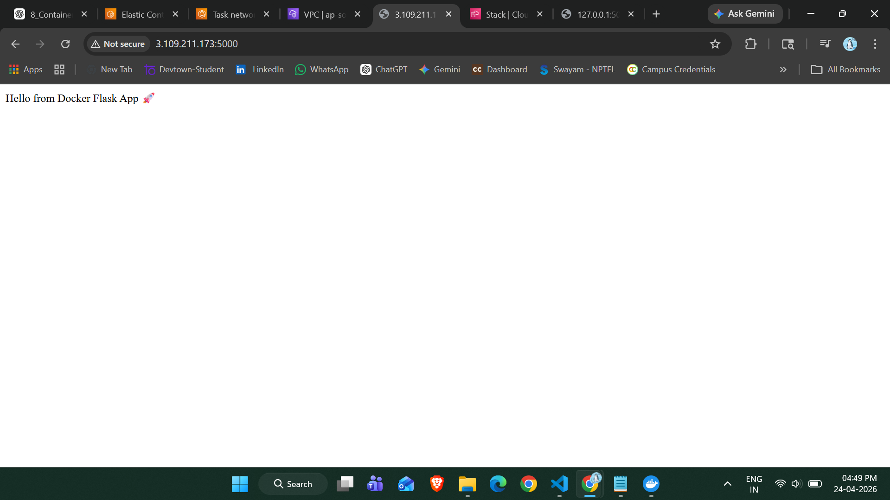

# 🚀 Containerized Flask Application using Docker, ECR & ECS

## 📌 Project Overview

This project demonstrates how to containerize a Python Flask application using Docker and deploy it on AWS using Amazon ECR and Amazon ECS (Fargate).

It covers the complete DevOps workflow:

* Building a Flask application
* Containerizing using Docker
* Pushing image to AWS ECR
* Deploying using ECS Fargate
* Accessing application via Public IP

---

## 🎯 Objectives

* Understand containerization using Docker
* Learn AWS ECR for image storage
* Deploy containers using ECS Fargate
* Expose application to the internet

---

## 🧰 Technologies Used

* Python (Flask)
* Docker
* AWS ECR (Elastic Container Registry)
* AWS ECS (Elastic Container Service - Fargate)
* AWS VPC & Security Groups
  
---

## ⚙️ Step-by-Step Implementation

### 🔹 Step 1: Create Flask Application

A simple Flask app is created that runs on port 5000.

---

### 🔹 Step 2: Create Dockerfile

Dockerfile is used to containerize the Flask application.

---

### 🔹 Step 3: Build Docker Image

```
docker build -t flask-app .
```

---

### 🔹 Step 4: Run Container Locally

```
docker run -p 5000:5000 flask-app
```

Test:

```
http://127.0.0.1:5000
```

---

### 🔹 Step 5: Push Image to AWS ECR

```
docker tag flask-app:latest <account-id>.dkr.ecr.ap-south-1.amazonaws.com/flask-app-repo
docker push <account-id>.dkr.ecr.ap-south-1.amazonaws.com/flask-app-repo
```

---

### 🔹 Step 6: Create ECS Cluster (Fargate)

* Cluster Name: flask-cluster
* Launch Type: Fargate

---

### 🔹 Step 7: Create Task Definition

* Image: ECR image URL
* Port: 5000
* CPU: 0.25 vCPU
* Memory: 512 MB

---

### 🔹 Step 8: Create Service

* Desired Tasks: 1
* Public IP: Enabled
* Security Group: Allow port 5000

---

### 🔹 Step 9: Access Application

Get Public IP from ECS Task and open:

```
http://<public-ip>:5000
```

---

## 🖼️ Screenshots

| Step              | Image Name                   |
| ----------------- | ---------------------------- |
| Project Structure | images/project_structure.png |
| Docker Build      | images/docker_build.png      |
| Docker Run        | images/docker_run.png        |
| Local Output      | images/local_output.png      |
| ECR Push          | images/ecr_push.png          |
| ECS Deployment    | images/ecs_deploy.png        |
| Final Output      | images/final_output.png      |

---

## 🌍 Final Output

The application was successfully deployed on AWS ECS (Fargate) and accessed via a public IP.

> ⚠️ Note: The live URL is no longer active as cloud resources were stopped to avoid unnecessary charges.

### 🖼️ Application Output



---

## 📌 Key Learnings

* Docker containerization
* AWS ECR image management
* ECS Fargate deployment
* Networking & security group configuration
* Debugging real-world deployment issues

---

## ⚠️ Important Notes

* Always use `0.0.0.0` in Flask app
* Open port 5000 in security group
* Enable Public IP in ECS service

---

## 🚀 Conclusion

This project demonstrates a complete end-to-end deployment of a containerized application using modern DevOps tools and AWS services.

---

## 🙌 Author

**Vaishnavi**
